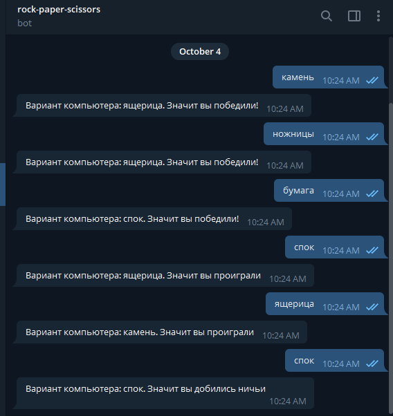

# Rock-paper-scissors-sneak-spok

Пример простого телеграм бот-игры, усовершенстованной версии камень ножницы бумага.

Используется telegram-api https://core.telegram.org/api



## Начало работы
Потребуется go версии 1.17 https://golang.org/dl/

В проекте используются следующие модули:
```dotenv
    github.com/joho/godotenv - для работы с .env файлом
```

В корне проекта создать .env файл и добавить следующие данные
```dotenv
TELEGRAM_API=https://api.telegram.org/bot
TELEGRAM_TOKEN=<token>
```

## Запуск приложения

```shell script
go run main.go
```

## Структура проекта
```
    go.mod      # Хранение модулей
    main.go     # Подключение к telegram-api, логика игры
    models.go   # Используемые модели для telegram-api
    .gitignore
    .env
    README.md
```